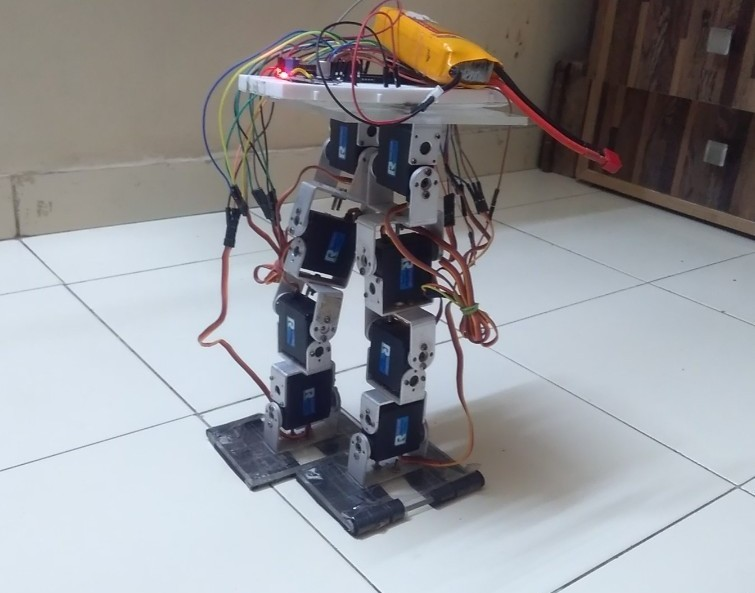

### Biped-Humanoid robot

Ardunio based Humanoid robot. Here I have created the simplest possible humanoid robot using Arduino and servo motors. Can be used when you have atleast three servos on each leg !

I have modeled the legs in Solidworks software.

<a href="https://www.youtube.com/watch?v=5w3RGbZgTs0">Walking Video</a>

